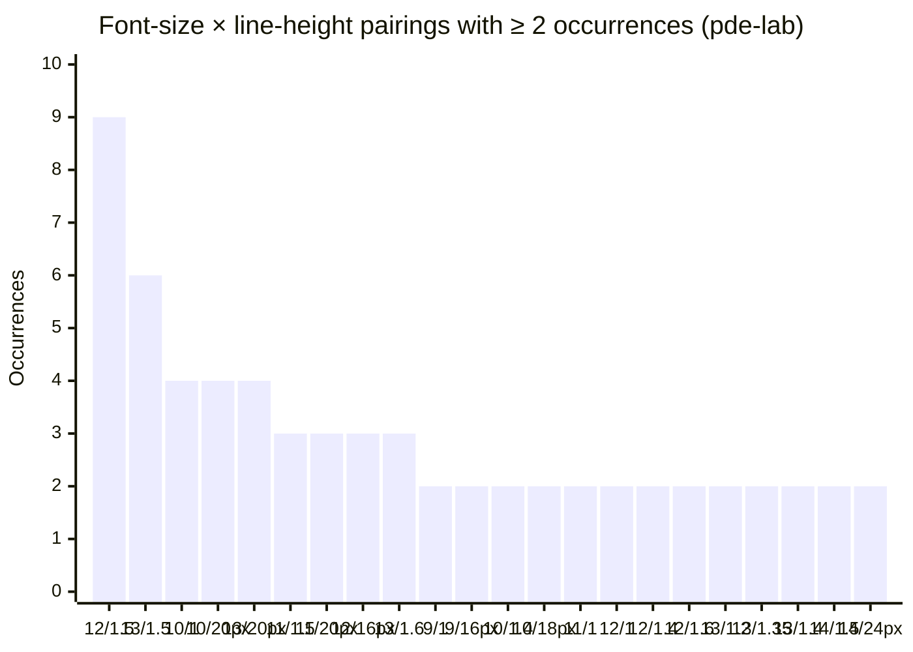
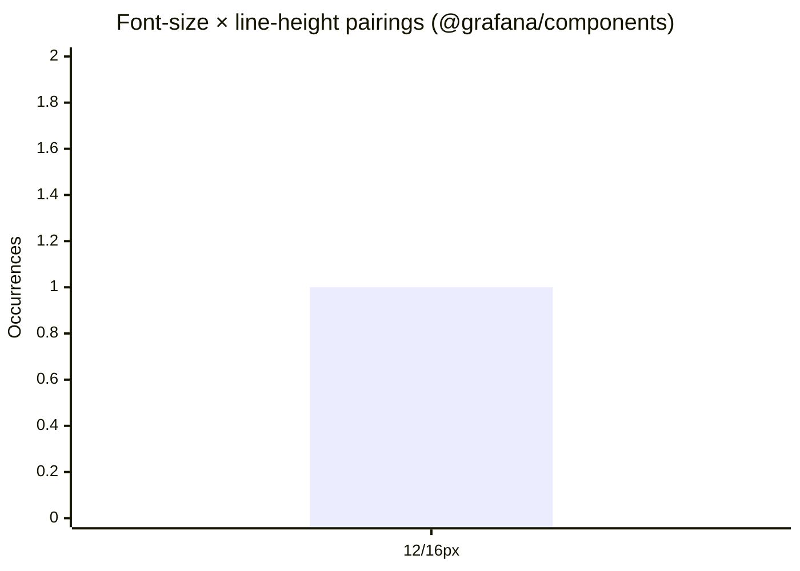

# pde-lab vs `@grafana/design-tokens`: token coverage gaps

Comparison of the CSS variables in `grafana-assistant-app/apps/plugin/src/pde-lab/design-tokens/tokens.css` against the tokens exposed by `@grafana/design-tokens` (this monorepo). Lists tokens that pde-lab consumers depend on but for which the local API has no direct analog.

Captured 2026-05-15.

## ✓ ~~Custom neutral palettes~~

- **`--color-gray-50`…`--color-gray-950`** — pde-lab ships a _custom_ gray ramp (different OKLCH values at every stop from Tailwind's). The local API exposed the Tailwind gray scale, so the variable names matched but resolved to different colors. **Status as of 2026-05-15: resolved.** The local `gray` primitive has been re-pointed to pde-lab's values in `tokens/colors/primitives.json`.
- ~~**`--color-gray-750-temporary`** — extra intermediate stop between 700 and 800 in pde-lab, with the comment "750 is an intermediate value until we can resolve the scaling between values". Not yet ported locally; we should treat it as a known temporary.~~ This color step is essentially unused in pde-lab so can be safely ignored.
- ~~**`--color-neutral-dark-50`…`--color-neutral-dark-950`** — a separate hex-valued neutral ramp (`#f9fafc` → `#090a0d`). No equivalent in the local API. Per pde-lab's comments (`/* light mode? */`) this is likely a sibling ramp to the dark-leaning custom gray scale.~~ This color scale is unused in pde-lab so can be safely ignored.

## Typography (font-size scale)

pde-lab uses a Tailwind-style flat `--text-*` scale; local uses a structured `--typography-font-size-{family}-{step}` scale with only four steps per family.

| pde-lab          | px  | Closest local equivalent                                       |
| ---------------- | --- | -------------------------------------------------------------- |
| `--text-xs`      | 12  | `--typography-font-size-monospace-sm` (12px) — _family-scoped_ |
| `--text-sm`      | 13  | none (closest local is 12 or 14)                               |
| `--text-base`    | 14  | `--typography-font-size-ui-md` (14px)                          |
| `--text-lg`      | 16  | `--typography-font-size-ui-lg` (16px)                          |
| **`--text-xl`**  | 18  | **no analog**                                                  |
| **`--text-2xl`** | 20  | **no analog**                                                  |
| **`--text-3xl`** | 24  | **no analog**                                                  |
| **`--text-4xl`** | 30  | **no analog**                                                  |
| **`--text-5xl`** | 36  | **no analog**                                                  |
| **`--text-6xl`** | 48  | **no analog**                                                  |

Everything from `--text-xl` (18px) up is missing locally: the local typography scale stops at `lg` (16px).

### Actual font-size usage within pde-lab components

Captured 2026-05-16. Counts the resolved `px` size across all hardcoded `fontSize:` declarations in pde-lab source (combining quoted-`px` strings and unitless numeric values, since React/Emotion render both as `px`). Excludes references that already go through `var(--text-*)`.

| Value     | Refs | Token analog                                      |
| --------- | ---- | ------------------------------------------------- |
| 9px       | 4    | _none_ (-> 10px)                                  |
| 10px      | 26   | _none_ (**new:** `--typography-font-size-ui-xxs`) |
| 11px      | 33   | _none_ (**new:** `--typography-font-size-ui-xs`)  |
| 12px      | 8    | `--text-xs` -> `--typography-font-size-ui-sm`     |
| 13px      | 8    | `--text-sm` -> 12px or 14px                       |
| 14px      | 3    | `--text-base` -> `--typography-font-size-ui-md`   |
| 16px      | 1    | `--text-lg` -> `--typography-font-size-ui-lg`     |
| `0.875em` | 3    | n/a (~10.5px -> 11px)                             |
| `0.9em`   | 1    | n/a (~10.8px)                                     |
| `1em`     | 1    | n/a (12px)                                        |
| `1.1em`   | 1    | n/a (~13.2px)                                     |
| `1.2em`   | 1    | n/a (~14.4px)                                     |

### Proposed new token sizes

| Size | Font size token                 |
| ---- | ------------------------------- |
| 10px | `--typography-font-size-ui-xxs` |
| 11px | `--typography-font-size-ui-xs`  |
| 12px | `--typography-font-size-ui-sm`  |
| 14px | `--typography-font-size-ui-md`  |
| 16px | `--typography-font-size-ui-lg`  |

Total: 90 hardcoded font-size declarations. ~63 (70%) are sub-12px sizes the scale doesn't cover: `10px` and `11px` alone account for 59 sites. Migrating these would require either adding an `xxs` step (and possibly smaller) or accepting that pde-lab's reality contains sizes below where the current scale begins.

> Update the font size tokens in typography.json based on the new table of proposed sizes under the heading "Proposed new token sizes".

#### 9px usage:

- `CanvasHeader` -> tab badge — can use 10px
- `HypothesisCard` (passed in to `HypothesisStatusBadge`) -> can be 10px
- `QuestionCard` used for keyboard shortcuts -> can be 10px

### Font-size usage in this monorepo's components

For context on the proposed sizes above, this is the actual font-size footprint across the monorepo (everything under `packages/components`, `packages/icons`, `packages/prototype`, `apps/storybook`, `apps/design-site`). Counts every site that resolves to a fixed px size, whether via the `@grafana/design-tokens` API (`fontSize.ui.sm` etc.), `var(--typography-font-size-*)` CSS references, hardcoded `'12px'` / unitless numerics in Emotion styles, or leakage from `@grafana/data`'s `theme.typography.*`.

| Px value | Occurrences | Equivalent current token       |
| -------- | ----------- | ------------------------------ |
| 10px     | 1           | `--typography-font-size-ui-xs` |
| 12px     | 17          | `--typography-font-size-ui-sm` |
| 13px     | 3           | _no analog_                    |
| 14px     | 3           | `--typography-font-size-ui-md` |

Breakdown by access pattern:

| Px  | Token API (`fontSize.{family}.{step}`)              | CSS var                                 | Hardcoded                      | Theme (`useTheme2`)                                        |
| --- | --------------------------------------------------- | --------------------------------------- | ------------------------------ | ---------------------------------------------------------- |
| 10  | —                                                   | —                                       | 1 (`'10px'`)                   | —                                                          |
| 12  | 7 (6× `fontSize.ui.sm`, 1× `fontSize.monospace.sm`) | 1 (`var(--typography-font-size-ui-sm)`) | 2 (1× `'12px'`, 1× `12`)       | 6 (5× `theme.typography.size.sm`, 1× `bodySmall.fontSize`) |
| 13  | —                                                   | —                                       | 3 (2× `'13px'`, 1× CSS `13px`) | —                                                          |
| 14  | 1 (`fontSize.ui.md`)                                | —                                       | —                              | 2 (`theme.typography.size.md`)                             |

Observations:

- **12px (`sm`) dominates** — 17 / 24 sites, 71% of all font-size declarations.
- **13px (3 sites) is the only used pixel value without a token analog**: all three appear in icon-gallery / code-display contexts (`Icons.stories.tsx`, `design-site/index.css`). Notably, none of them route through a token; they're all hardcoded.
- **`lg` (18px) is entirely unused** in the monorepo.
- **`theme.typography.*` leakage is non-trivial** (8 sites, ~33% of declarations): these reach into `@grafana/data`'s theme rather than this package's tokens. Worth migrating to `getDesignTokens()` to keep typography sourced from one place.

### Font-size × line-height pairings

Captured 2026-05-16. Each row is a unique pairing where both `fontSize`/`font-size` and `lineHeight`/`line-height` appear in the same brace-block (nested `&:hover {…}` etc. are excluded so siblings don't get mismatched). Relative line-heights are computed against the same-block font-size; em values use a 12px base per `--text-xs`.

#### pde-lab (grafana-assistant-app)

Scanned `apps/plugin/src/pde-lab/components/**/*.{ts,tsx,css}`.

| Font size | Line-height (literal) | Line-height (px) | Occurrences |
| --------- | --------------------- | ---------------- | ----------- |
| 9px       | `1`                   | 9px              | 2           |
| 9px       | `16px`                | 16px             | 2           |
| 10px      | `1`                   | 10px             | 4           |
| 10px      | `1.2`                 | 12px             | 1           |
| 10px      | `1.4`                 | 14px             | 2           |
| 10px      | `14px`                | 14px             | 1           |
| 10px      | `18px`                | 18px             | 2           |
| 10px      | `20px`                | 20px             | 4           |
| 11px      | `1`                   | 11px             | 2           |
| 11px      | `1.5`                 | 16.5px           | 3           |
| 11px      | `18px`                | 18px             | 1           |
| 11px      | `20px`                | 20px             | 3           |
| 12px      | `1`                   | 12px             | 2           |
| 12px      | `1.2`                 | 14.4px           | 1           |
| 12px      | `14px`                | 14px             | 1           |
| 12px      | `1.3`                 | 15.6px           | 1           |
| 12px      | `1.35`                | 16.2px           | 1           |
| 12px      | `16px`                | 16px             | 3           |
| 12px      | `1.4`                 | 16.8px           | 2           |
| 12px      | `1.5`                 | 18px             | 9           |
| 12px      | `1.6`                 | 19.2px           | 2           |
| 12px      | `20px`                | 20px             | 1           |
| 12px      | `1.8`                 | 21.6px           | 1           |
| 13px      | `1`                   | 13px             | 1           |
| 13px      | `1.2`                 | 15.6px           | 2           |
| 13px      | `1.3`                 | 16.9px           | 1           |
| 13px      | `1.35`                | 17.55px          | 2           |
| 13px      | `1.4`                 | 18.2px           | 2           |
| 13px      | `1.5`                 | 19.5px           | 6           |
| 13px      | `20px`                | 20px             | 4           |
| 13px      | `1.6`                 | 20.8px           | 3           |
| 14px      | `16px`                | 16px             | 1           |
| 14px      | `1.5`                 | 21px             | 2           |
| 14px      | `1.6`                 | 22.4px           | 1           |
| 14px      | `24px`                | 24px             | 2           |
| 16px      | `1`                   | 16px             | 1           |

These 22 combinations carry 65 of 79 paired declarations (82%). The remaining 14 combinations each appear once and are listed in the full table above.

**36 unique combinations across 79 paired declarations.** Total `fontSize:` declarations in pde-lab components: 231. Only ~34% pair an explicit line-height in the same block; the remaining 152 sites leave line-height to inheritance.

Observations:

- **12px / `1.5` (= 18px)** is the modal pairing (9 occurrences): the canonical "small body text" recipe.
- **13px / `1.5` (= 19.5px)** is the second-most-common (6 occurrences), in the gap the proposed scale doesn't fill.
- **A literal `20px` line-height recurs across four font-sizes (10/11/12/13px)**: looks like a "single-line UI badge" pattern where the line-height is sized to match a containing box rather than the typeface.
- **One unresolvable reference**: `var(--text-md)`. pde-lab's scale doesn't define `md`; likely a typo for `--text-base` (14px) or `--text-sm` (13px).

#### @grafana/components (this repo)

Scanned `packages/components/src/components/**/*.{ts,tsx,css}`.

| Font size | Line-height (literal) | Line-height (px) | Occurrences |
| --------- | --------------------- | ---------------- | ----------- |
| 12px      | `16px`                | 16px             | 1           |

**1 unique combination across 1 paired declaration.** Total `fontSize:` declarations: 9 — only one (`ComparisonBadge.styles.ts`, where `lineHeight: '${BADGE_HEIGHT}px'` lands on 16px) co-locates an explicit line-height. The other 8 sites leave line-height to inheritance or set the two properties across different selectors.

@grafana/components is essentially a non-consumer of paired font-size + line-height. pde-lab's 36 combinations against 79 pairings shows no consistent line-height system today: each site picks values to suit its local layout rather than referencing a shared scale. Useful evidence if/when a `lineHeight` primitive is added.

## ✓ ~~Motion~~

- ~~**`--transition-duration-fast` (150ms), `--transition-duration-medium` (250ms), `--transition-duration-slow` (500ms), `--transition-timing` (`ease-in-out`)** — local has zero motion/transition tokens.~~ Implemented as `primitives.transition`.

## Shadows

Local exposes `--shadow-none` and `--shadow-xs/sm/md/lg/xl`. pde-lab adds:

- **`--shadow-2xl`** — no analog locally (local stops at `xl`).
- **`--shadow-outline`, `--shadow-outline-xs`, `--shadow-outline-sm`, `--shadow-outline-md`, `--shadow-outline-lg`, `--shadow-outline-xl`, `--shadow-outline-2xl`** — entire outline-shadow family is missing locally.
- **`--shadow-color`** — pde-lab exposes a single themeable color primitive (`rgba(0,0,0,0.15)` dark / `rgba(0,0,0,0.08)` light) that all the shadow values reference. Local shadows are baked composites with no extractable color primitive.

pde-lab's shadow values are _also_ structurally different: they're stacked, color-mode-aware composites built on `--shadow-color`, where local's shadows are flat, non-color-mode-aware strings under the `primitives.shadow` scale. Even where the names overlap (`--shadow-sm` etc.), the resolved values won't match.

### Actual `box-shadow` usage within pde-lab components

Captured 2026-05-16. Every unique `boxShadow`/`box-shadow` value used across `apps/plugin/src/pde-lab/components/**/*.{ts,tsx,css,scss}`, with the number of times each value appears.

The component-local CSS variables (`--workspace-share-dialog-shadow` etc.) are defined per color-mode via `cssVariablesByColorMode`-style runtime declarations in each component's `.styles.ts`; the **light** and **dark** values shown below are what each one resolves to in the respective mode. Where multiple component-local vars share the same `(light, dark)` definition, the rows are consolidated.

| Value                                                                                                                                                                                                                         | Occurrences |
| ----------------------------------------------------------------------------------------------------------------------------------------------------------------------------------------------------------------------------- | ----------- |
| `none`                                                                                                                                                                                                                        | 9           |
| `var(--shadow-outline-sm)`                                                                                                                                                                                                    | 5           |
| `0 0 0 10px transparent`                                                                                                                                                                                                      | 3           |
| `none !important`                                                                                                                                                                                                             | 3           |
| **light:** `none`   **dark:** `var(--shadow-outline-md)`   _(chat-frame-main, code-block-content, tool-card-output)_                                                                                                    | 3           |
| **light:** `0 0 0 1px rgba(0, 0, 0, 0.1), 0 1px 2px rgba(0, 0, 0, 0.06)`   **dark:** `0 0 0 1px rgba(255, 255, 255, 0.08)`   _(canvas-header-icon-container, chat-header-icon-container, error-message-icon-container)_ | 3           |
| `0 0 0 1px var(--color-gray-300)`                                                                                                                                                                                             | 2           |
| `var(--shadow-outline-md)`                                                                                                                                                                                                    | 2           |
| `var(--shadow-xl)`                                                                                                                                                                                                            | 2           |
| **light:** `var(--shadow-lg)`   **dark:** `var(--shadow-xl)`   _(tooltip)_                                                                                                                                              | 1           |
| **light:** `0 25px 50px -12px rgba(0, 0, 0, 0.15)`   **dark:** `var(--shadow-outline-2xl)`   _(workspace-share-dialog)_                                                                                                 | 1           |
| **light:** `0 8px 24px rgba(0, 0, 0, 0.2)`   **dark:** `var(--shadow-xl)`   _(story-popover-chrome)_                                                                                                                    | 1           |
| **light:** `0 8px 24px rgba(0, 0, 0, 0.3)`   **dark:** `var(--shadow-xl)`   _(popover-menu)_                                                                                                                            | 1           |
| **light:** `0 25px 50px -12px rgba(0, 0, 0, 0.15)`   **dark:** `0 25px 50px -12px rgba(0, 0, 0, 0.5)`   _(feedback-modal-container)_                                                                                    | 1           |
| **light:** `0 25px 50px -12px rgba(0, 0, 0, 0.2)`   **dark:** `0 25px 50px -12px rgba(0, 0, 0, 0.5)`   _(expand-modal-card)_                                                                                            | 1           |
| **light:** `0 -5px 6px -2px rgba(0, 0, 0, 0.15)`   **dark:** `0 -5px 6px -2px rgba(0, 0, 0, 0.05)`   _(chat-frame-container)_                                                                                           | 1           |
| `0 0 0 1.5px var(--chat-track-user-sub-avatar-halo-color)`                                                                                                                                                                    | 1           |
| `0 0 0 1px rgba(255, 255, 255, 0.08)`                                                                                                                                                                                         | 1           |
| `0 0 0 3px color-mix(in srgb, var(--button-${type}-focus-outline-color) 70%, transparent)`                                                                                                                                    | 1           |
| `0 0 0 3px color-mix(in srgb, var(--infrastructure-memory-focus-outline-color) 70%, transparent)`                                                                                                                             | 1           |
| `0 0 0 3px color-mix(in srgb, var(--pill-focus-outline) 50%, transparent)`                                                                                                                                                    | 1           |
| `0 10px 30px rgba(0, 0, 0, 0.22)`                                                                                                                                                                                             | 1           |
| `0 1px 2px rgba(0, 0, 0, 0.06)`                                                                                                                                                                                               | 1           |
| `0 1px 3px 0 rgba(0, 0, 0, 0.04), 0 1px 2px -1px rgba(0, 0, 0, 0.03)`                                                                                                                                                         | 1           |
| `0 4px 12px rgba(0, 0, 0, 0.3)`                                                                                                                                                                                               | 1           |
| `inset 0 0 0 1.5px var(--color-orange-500)`                                                                                                                                                                                   | 1           |
| `inset 0px -35px 15px -7px var(--conversation-list-groups-loading-more-shadow-color)`                                                                                                                                         | 1           |
| `var(--shadow-sm)`                                                                                                                                                                                                            | 1           |

**28 unique values across 51 total declarations** (after consolidation; was 32 before expanding the per-component shadow vars). Two component-local shadow variables turned out to be aliases for the same definition across multiple components:

- `chat-frame-main-box-shadow` = `code-block-content-box-shadow` = `tool-card-output-box-shadow` — all `none` (light) / `var(--shadow-outline-md)` (dark).
- `canvas-header-icon-container-box-shadow` = `chat-header-icon-container-box-shadow` = `error-message-icon-container-box-shadow` — all the same hex / white-alpha icon-container halo.

Notable patterns:

- **`none` / `none !important`** (12 declarations, 24%) — almost a quarter of all declarations are shadow resets, typically overriding an inherited shadow on hover / focus / active states.
- **Shadow-scale tokens are used more than they look once vars are expanded.** Directly: 10 declarations (20%) — `--shadow-outline-sm` (5), `--shadow-outline-md` (2), `--shadow-xl` (2), `--shadow-sm` (1). Indirectly: many of the per-component vars resolve to scale tokens in dark mode (`--shadow-outline-md`, `--shadow-xl`, `--shadow-outline-2xl`). Including indirect references, dark-mode shadows mostly _do_ flow through the scale.
- **Light/dark asymmetry is the real story.** Look at the per-component pairs: the dark column lands on a scale token surprisingly often; the light column is almost always a hand-rolled `rgba()` value. The scale works for dark mode but light mode keeps drifting into bespoke shadows.
- **Raw `rgba()` / `color-mix()` shadows** (8 declarations) bypass the scale entirely. These are mostly focus-ring effects (`0 0 0 3px color-mix(...)`) and bespoke drop shadows that don't fit the existing `--shadow-{xs,sm,md,lg,xl}` ramp.

The takeaway: pde-lab _has_ a shadow scale and dark-mode callers mostly use it (after indirection through per-component vars). The pure-light-mode definitions are where divergence concentrates. If we port the outline-shadow family + `2xl` step locally we'd cover most pde-lab dark-mode usage. Light-mode parity is a separate question: either a light-mode-specific scale, or scrutiny on whether each light-mode value is intentional or just legacy.

## What does line up

- Tailwind hue scales (`red`, `orange`, `amber`, `yellow`, `lime`, `green`, `emerald`, `teal`, `cyan`, `sky`, `blue`, `indigo`, `violet`, `purple`, `fuchsia`, `pink`, `rose`) — all 50–950 stops match exactly.
- `--color-black`, `--color-white`.
- Tailwind `neutral` (lightness-only) — matches local.
- `--color-gray-*` — now matches after 2026-05-15 update (see above).

Local additionally ships `slate`, `stone`, `zinc` plus the entire `legacy.*` namespace (palette + semantic colors + box-shadows mirroring `useTheme2()`) and `border-radius`/`border-width` scales, none of which pde-lab covers, but those are extras on our side, not gaps.
